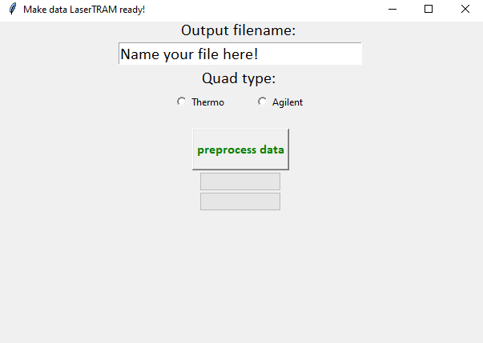
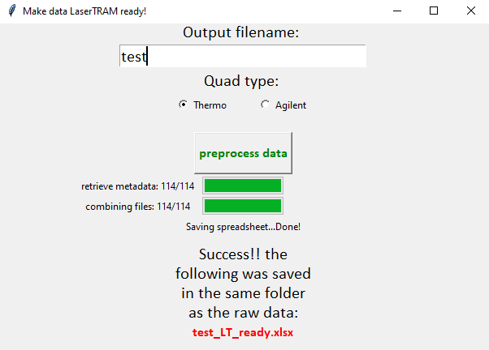

# multifiler

`multifiler` is a small, but very useful GUI for getting data ready for processing in [`LaserTRAM-DB`](https://github.com/jlubbersgeo/laserTRAM-DB). Its sole purpose is to take a folder filled with .csv files directly output from either a Thermo iCAP series or Agilent 8900 QQQ quadrupole mass spectrometer and combine them into a single spreadsheet that has the following format:
| timestamp | SampleLabel | Time | analyte 1 | ... | analyte n |
|:-------------------:|:-----------:|:-----:|:---------:|:---:|:---------:|
| 2022-10-10 22:44:00 | GSE-1G_1 | 13.24 | 100000 | ... | 100 |

## Usage

The easiest way to use `multifiler` is to go [here](https://drive.google.com/drive/folders/1vECM690szcXf54rm-DI3Hz1OH5BAJYjq?usp=sharing) and download the zip file, unpack it, and follow the instructions in the README.txt file. However, if you are on a Mac this won't work and you can just run it like you would any python script.

```
git clone https://github.com/jlubbersgeo/multifiler
cd /path/to/multifiler
conda env create -f multifiler.yml
conda activate multifiler
python multifiler.py
```

Upon startup:



Simply enter the name of the to-be-saved file, check which type of quad you used, and press the "preprocess data" button! The progress bars will progress and upon completion you will be left with something that looks like the following:



Congrats! You're now ready for `LaserTRAM-DB` and have saved a lot of time copying and pasting from individual spreadsheets...

## Contact

Jordan Lubbers (jlubbers@usgs.gov)
